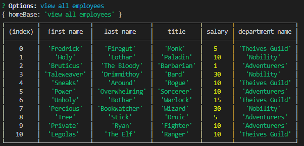
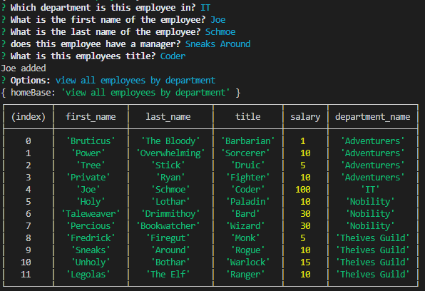

# parkers-employee-tracker
Track who manages who with this employee tracker

[Link to repository](https://github.com/MorgansPlayGames/parkers-employee-tracker)

[Video of parkers-employee-tracker in action](https://drive.google.com/file/d/1F-Ua20hTp_jy1ZsOoWI9o9vWXVzCyvvH/view)

1. [ Description. ](#description)
2. [ Technology Used.](#technology-used)
2. [ Installation ](#installation-instructions)
3. [ Usage Information ](#usage-information)
4. [ Contribution Guidelines ](#contribution-guidelines)
5. [ Licence ](#licence)
6. [ Questions ](#questions?)

## Description:
    Terminal that will interact with an employeedb to add modify and remove employees, roles, and departments

## Technology Used
    JS
    SQL
    Node:
        Inquirer
        Mysql
        Console.table

### Installation Instructions
    Download
    'npm install' to install dependancies.
    mysql run the code in seed.sql to create employeedb
    'npm start' or 'node server.js'  
 
### Usage Information
    On run, following the prompts, User can:
    * view departments, roles, and employees
    * view employees by department or role
    * add, remove, or modify an employee to the database
    * add or remove departments and roles.

### Contribution Guidelines
    Fork, update, and
    Submit your code to me!

### Licence 
    Copyright (c) 2020, Parker Morgan
    All rights reserved.
        
    This source code is licensed under the MIT-style license found in the
    LICENSE file in the root directory of this source tree.

### Questions?
    GitHub: MorgansPlayGames
    Email: jpmaster13@msn.com